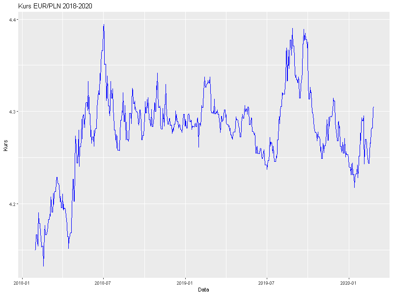
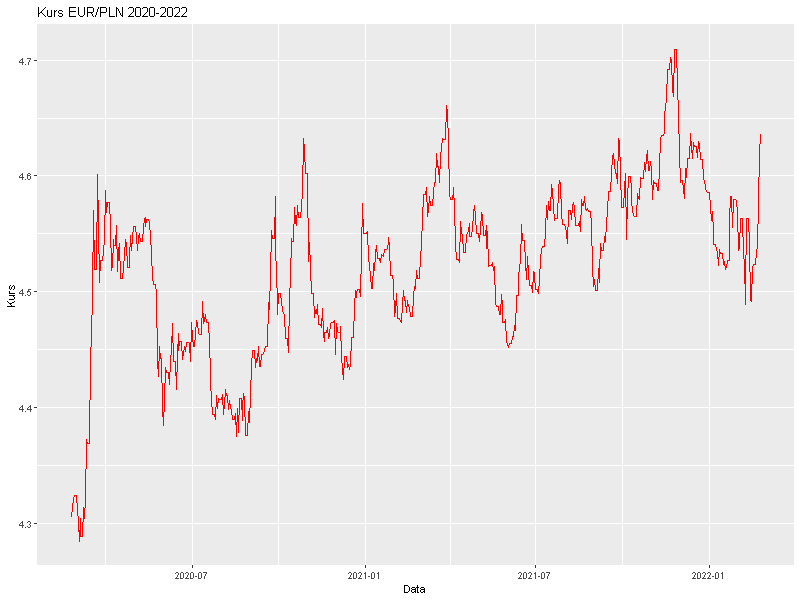
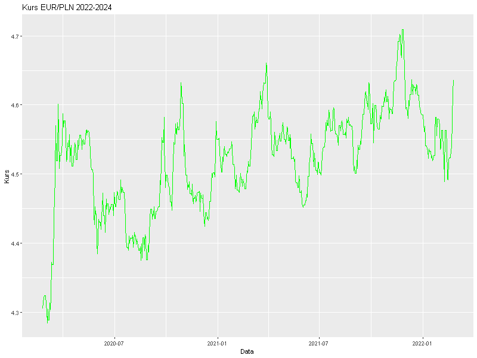

# Analiza kursu EUR/PLN (2018-2024)

Projekt zawiera analizę kursu EUR/PLN w trzech okresach:  
- **Okres bazowy (2018-2020)**  
- **Okres COVID (2020-2022)**  
- **Okres wojny (2022-2024)**  

Analiza obejmuje:  
- Obliczanie logarytmicznych stóp zwrotu  
- Testy statystyczne (t-test, test normalności)  
- Bootstrap średnich i wariancji  
- Wykresy zmian kursu w każdym okresie  

---

## Wykresy kursu EUR/PLN

### Okres bazowy (2018-2020)

### Okres COVID (2020-2022)

### Okres wojny (2022-2024)

---

## Pliki w repozytorium
- `data/EURPLNbaza.csv` – dane dla okresu bazowego  
- `data/EURPLNcovid.csv` – dane dla okresu COVID  
- `data/EURPLNwojna.csv` – dane dla okresu wojny  
- `EURPLN_analysis.R` – główny skrypt R  
- `images/EURPLNbaza.png`, `images/EURPLNcovid.png`, `images/EURPLNwojna.png` – wykresy  

---

## Instrukcja uruchomienia
1. Otwórz skrypt `EURPLN_analysis.R` w RStudio.  
2. Upewnij się, że folder `data` zawiera wszystkie pliki CSV.  
3. Uruchom skrypt, aby wygenerować wyniki i wykresy.  
4. Wygenerowane wykresy można zobaczyć w folderze `images`.  

---

## Autor
Konrad Zomkowski  
