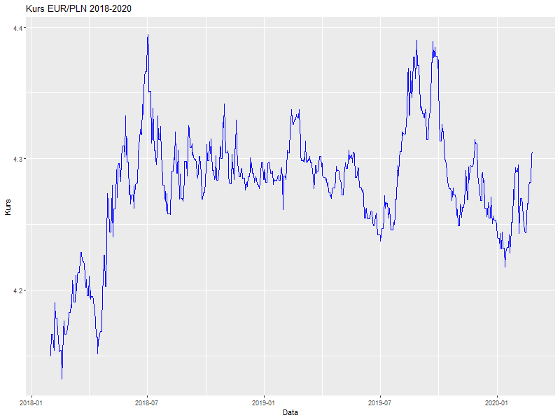
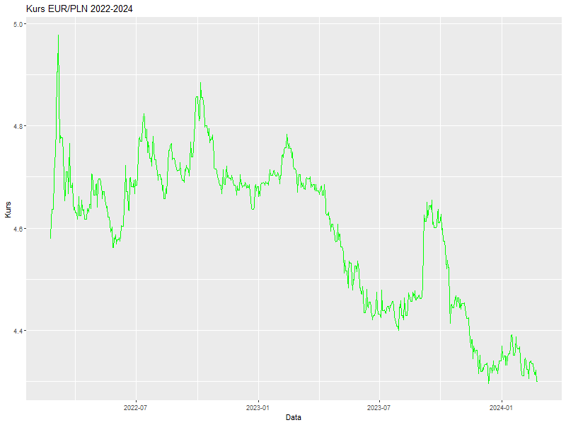

# Analiza kursu EUR/PLN (2018-2024)

Analiza kursu EUR/PLN (2018-2024)

Projekt stanowi skróconą wersję analizy przeprowadzonej w pracy licencjackiej. 
W pełnej pracy badaniu poddano sześć par walutowych w relacji do euro: 
EUR/USD, EUR/GBP, EUR/AUD, EUR/PLN, oraz EUR/TRY . 

Repozytorium prezentuje fragment analizy dotyczący pary EUR/PLN.

Projekt zawiera analizę kursu EUR/PLN w trzech okresach:

Projekt zawiera analizę kursu EUR/PLN w trzech okresach:  
- **Okres bazowy (2018-2020)**  
- **Okres COVID (2020-2022)**  
- **Okres wojny (2022-2024)**  

Analiza obejmuje:  
- Obliczanie logarytmicznych stóp zwrotu  
- Testy statystyczne (t-test, test normalności)  
- Bootstrap średnich i wariancji  
- Wykresy zmian kursu w każdym okresie  

---

## Wykresy kursu EUR/PLN

### Okres bazowy (2018-2020)

### Okres COVID (2020-2022)

### Okres wojny (2022-2024)

---

## Wnioski

Para EUR/PLN w badanych okresach (2018–2024) wykazywała stosunkowo niską zmienność i stabilne średnie stopy zwrotu, zarówno w okresie bazowym, pandemii, jak i wojny. Zarówno testy t-Studenta, jak i testy bootstrapowe nie wskazały istotnych statystycznie odchyleń od zera, co oznacza, że kurs euro do złotego nie ulegał znaczącym zmianom kierunkowym. Stabilność tej pary sugeruje, że złoty jest relatywnie odporny na globalne kryzysy i wahania rynków walutowych w porównaniu do bardziej niestabilnych walut, takich jak turecka lira.

## Pliki w repozytorium
- `data/EURPLNbaza.csv` – dane dla okresu bazowego  
- `data/EURPLNcovid.csv` – dane dla okresu COVID  
- `data/EURPLNwojna.csv` – dane dla okresu wojny  
- `EURPLN_analysis.R` – główny skrypt R  
- `data/EURPLNbaza.png`, `data/EURPLNcovid.png`, `data/EURPLNwojna.png` – wykresy  

---

## Instrukcja uruchomienia
1. Otwórz skrypt `EURPLN_analysis.R` w RStudio.  
2. Upewnij się, że folder `data` zawiera wszystkie pliki CSV.  
3. Uruchom skrypt, aby wygenerować wyniki i wykresy.  
4. Wygenerowane wykresy można zobaczyć w folderze `images`.  

---

## Autor
Konrad Zomkowski  
